Please see explained results of experiments below 🙏🙏🙏

Install dependencies: `pip install -r requirements.txt`

In addition to MNIST, experiments are also run on Fashion-MNIST because MNIST converges quickly and can hide differences between acquisition strategies.

---

## Classification Experiments

### Experiment 1: Comparison of acquisition functions
- Run: `python3 -m experiments.run_cnns --config configs/base.yaml --results-directory results/classification_base`
- Plot: `python3 -m experiments.plot_exp1 --results-directory results/classification_base`

Results (MNIST):
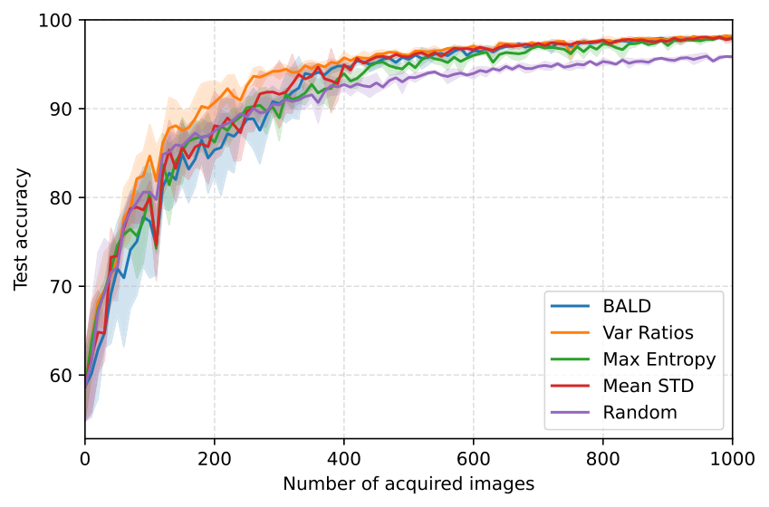

On MNIST, uncertainty-based acquisition works better than Random in the early steps, and the curves converge as more labels are acquired.

Number of acquired images needed to reach an error threshold on MNIST:

| Acquisition Function | Threshold | Acquired (mean ± std) | Step (mean ± std) |
|---------------------|-----------|----------------------|-------------------|
| BALD | 0.05 | 400.0 ± 10.0 | 40.0 ± 1.0 |
| BALD | 0.1 | 266.7 ± 49.3 | 26.7 ± 4.9 |
| Var Ratios | 0.05 | 350.0 ± 10.0 | 35.0 ± 1.0 |
| Var Ratios | 0.1 | 176.7 ± 45.1 | 17.7 ± 4.5 |
| Max Entropy | 0.05 | 473.3 ± 49.3 | 47.3 ± 4.9 |
| Max Entropy | 0.1 | 253.3 ± 15.3 | 25.3 ± 1.5 |
| Mean STD | 0.05 | 366.7 ± 50.3 | 36.7 ± 5.0 |
| Mean STD | 0.1 | 260.0 ± 70.0 | 26.0 ± 7.0 |
| Random | 0.05 | 720.0 ± 55.7 | 72.0 ± 5.6 |
| Random | 0.1 | 253.3 ± 11.5 | 25.3 ± 1.2 |

Minor deviations from the paper are expected due to training protocol differences and randomness (splits, batching, initialization).

---

#### Fashion-MNIST (same experiment)
- Run: `python3 -m experiments.run_cnns --config configs/fashion.yaml --results-directory results/classification_fashion`
- Plot: `python3 -m experiments.plot_exp1 --results-directory results/classification_fashion`

Results (Fashion-MNIST):

On Fashion-MNIST, Random sampling is often competitive and max entropy acquisition can look unstable. Fashion-MNIST contains many genuinely hard and visually similar classes (e.g., shirt/top/pullover), so high predictive entropy does not always mean “useful for improving the classifier”. As a result, selecting the top-entropy points may produce a batch that is dominated by ambiguous near-boundary examples or class-imbalanced. Since we retrain the model from scratch each round (with the same initialization), the newly acquired batch can noticeably reshape the decision boundary. If that batch is not representative, test accuracy can temporarily drop after retraining, and then recover in later rounds as the labeled set grows and becomes more balanced and informative overall.

---

### Experiment 2: Importance of model uncertainty

- Run: `python3 -m experiments.run_cnns --config configs/base.yaml --results-directory results/classification_base`
- Plot: `python3 -m experiments.plot_exp2 --results-directory results/classification_base`

Results (MNIST):
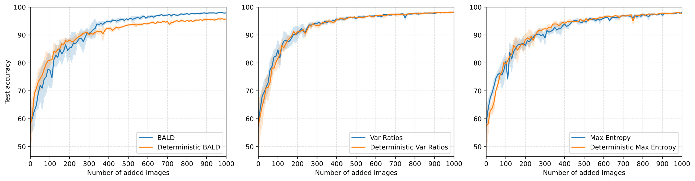

With dropout disabled and T=1, BALD scores are zero for all samples; in our implementation we do random selection in this case. However, BALD benefits the most from Bayesian inference because it targets epistemic uncertainty. 

#### Fashion-MNIST (same experiment)
- Run: `python3 -m experiments.run_cnns --config configs/fashion.yaml --results-directory results/classification_fashion`
- Plot: `python3 -m experiments.plot_exp2 --results-directory results/classification_fashion`

On Fashion-MNIST the Bayesian–deterministic difference can be less stable due to harder data and uncertainty miscalibration.

---

### Extension: Active Learning with Diversity (Fashion-MNIST)
- Run: `python3 -m experiments.run_cnns --config configs/fashion_div.yaml --results-directory results/classification_fashion_div`
- Plot (acquisition comparison): `python3 -m experiments.plot_exp1 --results-directory results/classification_fashion_div`
- Plot (deterministic vs Bayesian): `python3 -m experiments.plot_exp2 --results-directory results/classification_fashion_div`

Results:
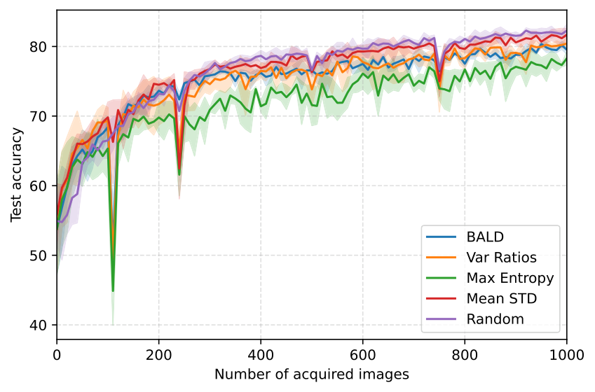

Diversity reduces redundancy (near-duplicate points in a batch). In this setup it mainly stabilizes selection, but it does not guarantee an improvement over Random on Fashion-MNIST.

---

## Regression Experiments

### Minimum Extension — Inference methods comparison (RMSE)
- Run (MNIST): `python3 -m experiments.regression --config configs/base_regression.yaml --results-directory results/regression`
- Run (Fashion-MNIST): `python3 -m experiments.regression --config configs/fashion_regression.yaml --results-directory results/regression_fashion`
- Plot (MNIST): `python3 -m experiments.plot_regression --results-directory results/regression`
- Plot (Fashion-MNIST): `python3 -m experiments.plot_regression --results-directory results/regression_fashion`

Results (MNIST, all inference methods: analytic, MFVI, vi, vi-full):
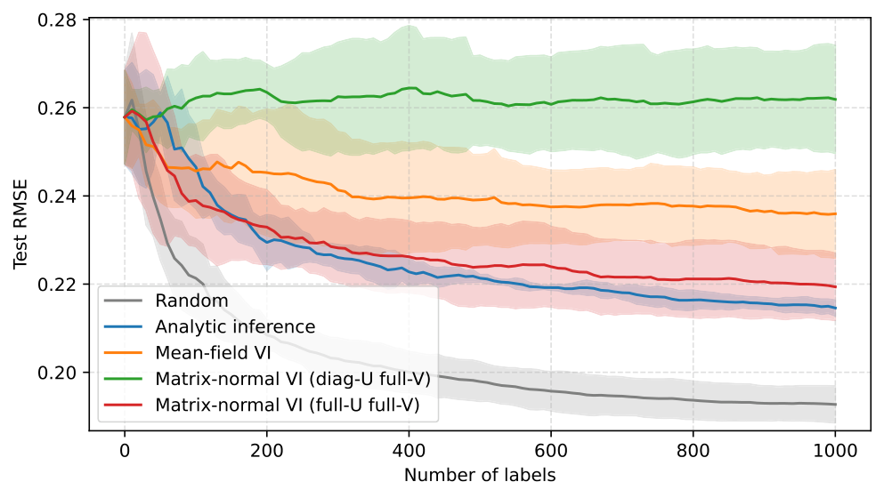

Results (Fashion-MNIST, all inference methods: analytic, MFVI, vi, vi-full):
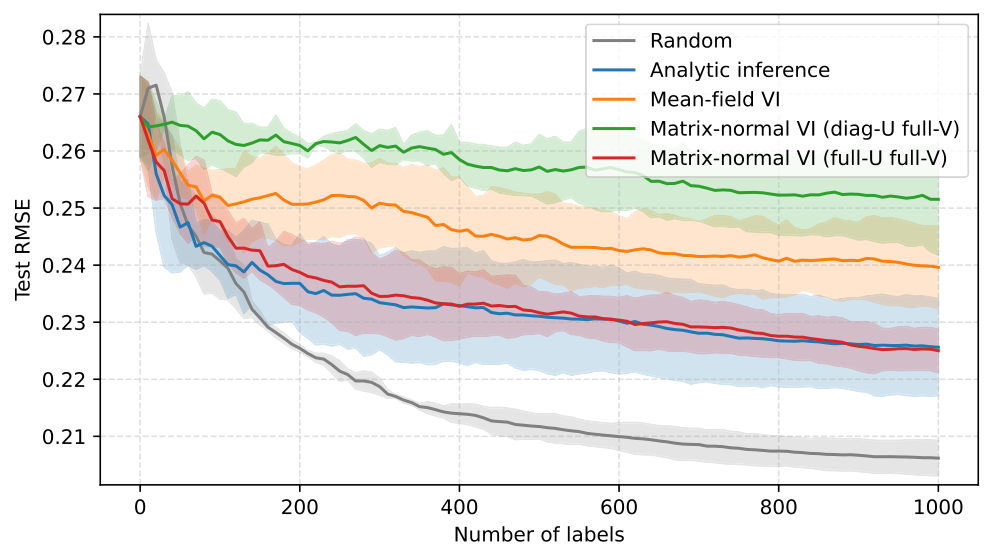

Variance-based acquisition underperform Random on RMSE:

1) Reducing variance and uncertainty doesn't mean reducing RMSE, especially under strong model limitations (we do Gaussian regression on discrete one-hot labels)
2) We freeze features and inference only last layer
3) We do not scale embedding and feature norms 
4) Reducing uncertainty doesn't mean improving generalization 
5) Random sampling  provides more  coverage.

Classification behaves better because the model is trained fully and acquisition scores correspond to class uncertainty (we improve class border; during AL process we are choosing points near the border).

In these runs:
1) Random gives the lowest RMSE (better coverage)
2) Analytic and full-covariance VI are close to each other
3) As expected, mean-field VI is the least effective here due to its assumptions (outputs and features are not correlated). VI with correlations between outputs is more effective but still worse than full-covariance VI.

---

### Extension: Regression with OOD pool
- Config: `configs/ood_mnist_fashion.yaml`
- Run: `./experiments/run_ood_experiments.sh`
- Plotting: `./experiments/plot_ood_experiments.sh`

Results (all inference methods: analytic, MFVI, vi, vi-full):
- OOD ratio 0.0: 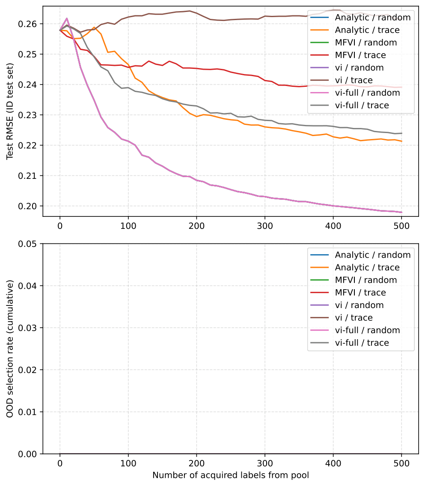
- OOD ratio 0.1: 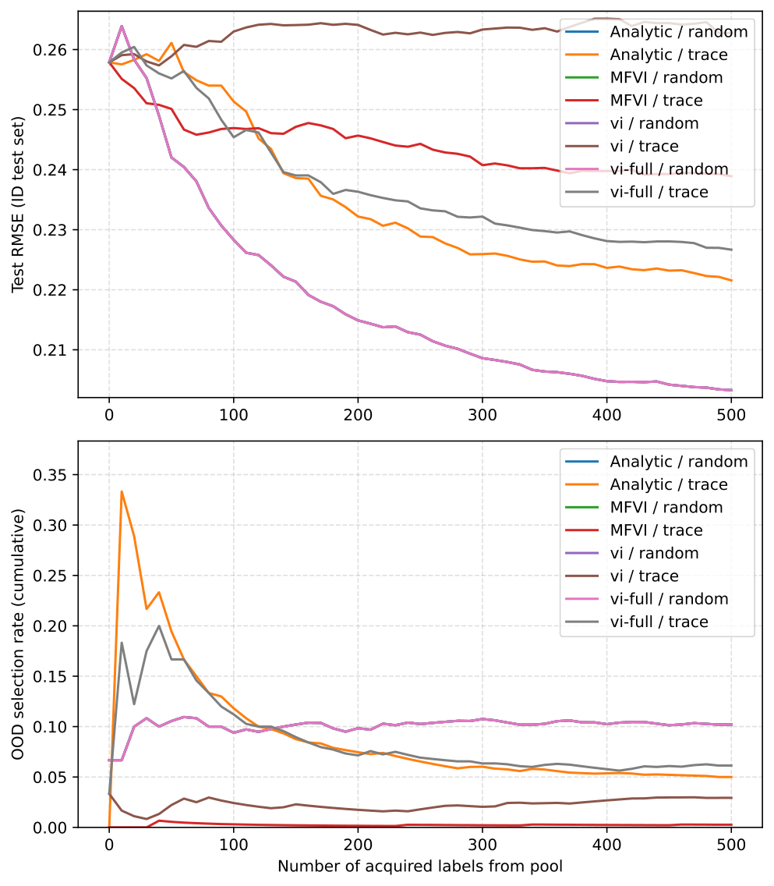
- OOD ratio 0.3: 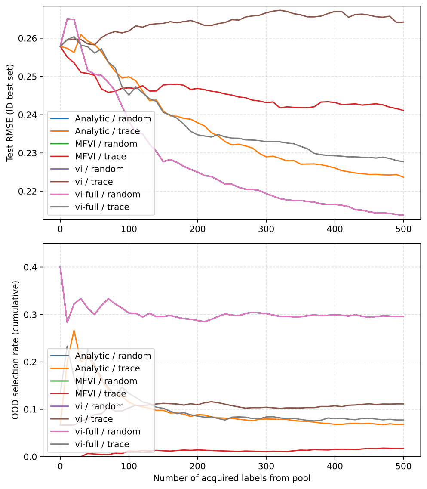
- OOD ratio 0.5: 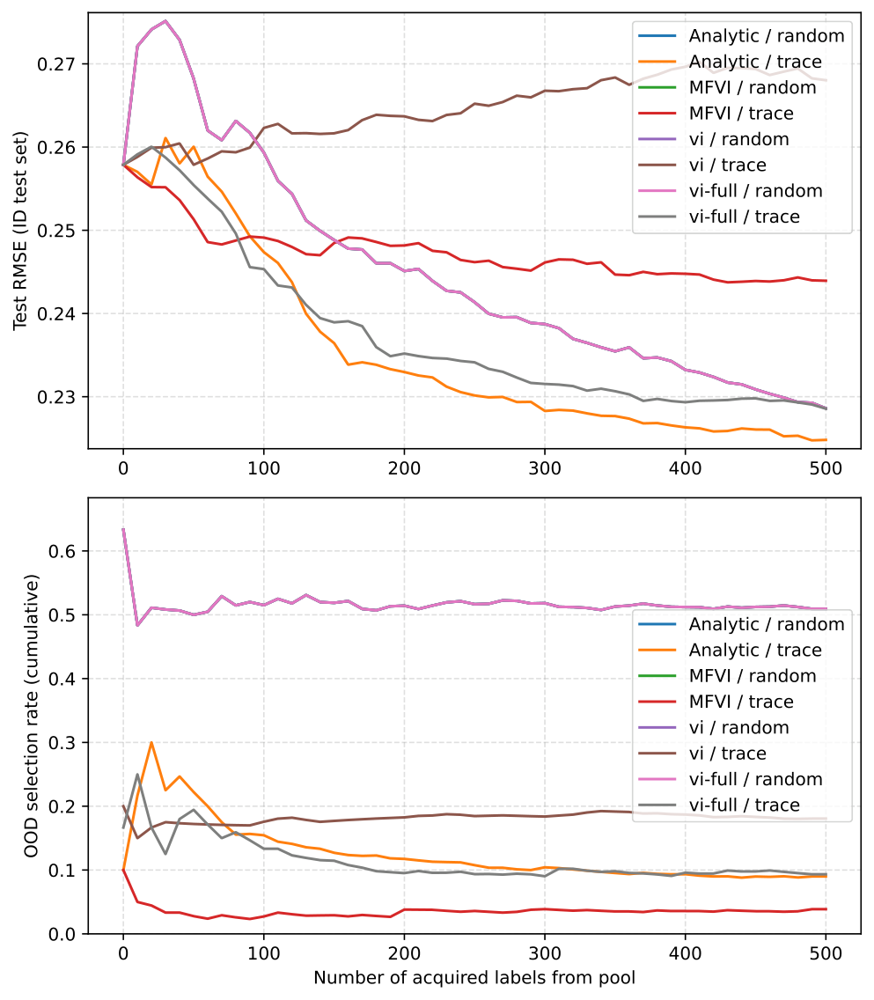

Each OOD plot shows ID test RMSE and the cumulative OOD fraction among selected labels. With OOD in the pool, uncertainty-based strategies can over-select OOD early (OOD often has higher epistemic uncertainty).

1) For OOD ratio 0.0 the OOD selection rate stays at 0, as expected.
2) Strategies that keep the OOD selection rate closer to the pool ratio tend to be more stable on the ID test RMSE in this setup.

---

### Extension: Active Learning with Diversity (Regression)
- Run: `python3 -m experiments.regression --config configs/fashion_regression_div.yaml --results-directory results/regression_fashion_div`
- Plot: `python3 -m experiments.plot_regression --config configs/fashion_regression_div.yaml --results-directory results/regression_fashion_div`

Results:
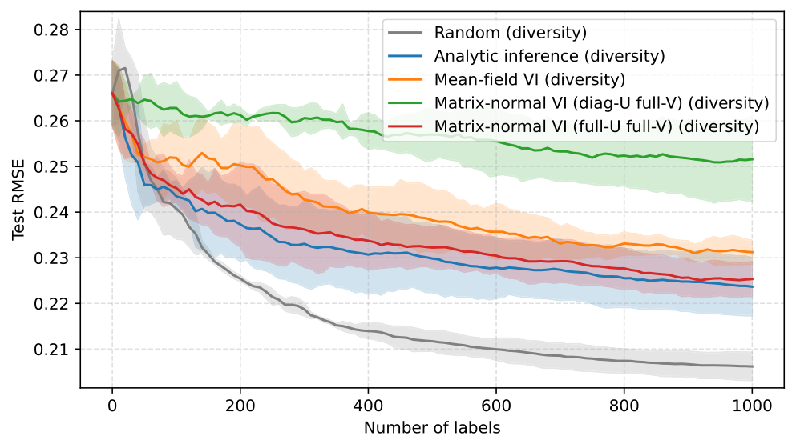

Diversity helps reduce redundancy in batch selection, but it may not fully close the gap if the acquisition score is not well aligned with RMSE.

---

## Extension: Noisy Oracle Experiments

- Run (classification): `python3 -m experiments.noisy_oracle --config configs/noisy_oracle.yaml --results-directory results/classification_noisy_oracle`
- Run (regression): `python3 -m experiments.noisy_oracle --config configs/noisy_oracle.yaml --results-directory results/regression_noisy_oracle`
- Plot (classification): `python3 -m experiments.plot_noisy_oracle --config configs/noisy_oracle.yaml --results-directory results/classification_noisy_oracle`
- Plot (regression): `python3 -m experiments.plot_noisy_oracle --config configs/noisy_oracle.yaml --results-directory results/regression_noisy_oracle`

Classification:
- η = 0.0: 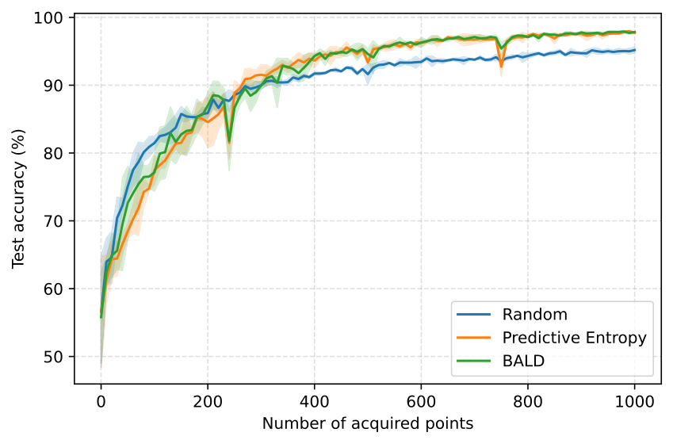
- η = 0.15: 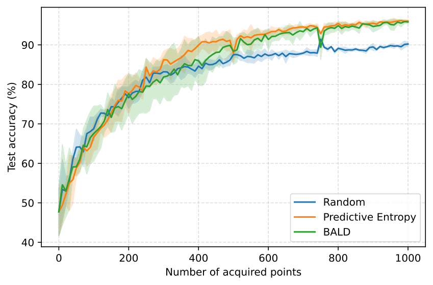

Regression:
- η = 0.0: 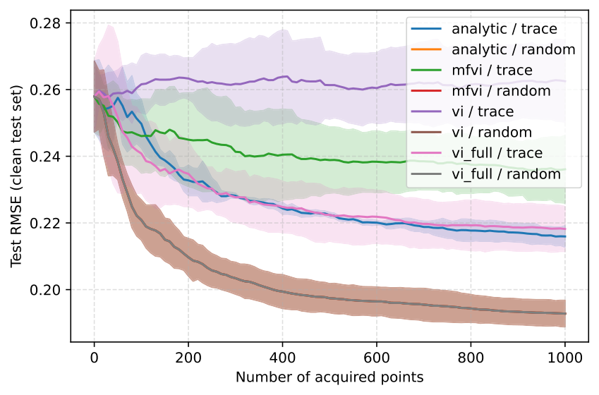
- η = 0.15: 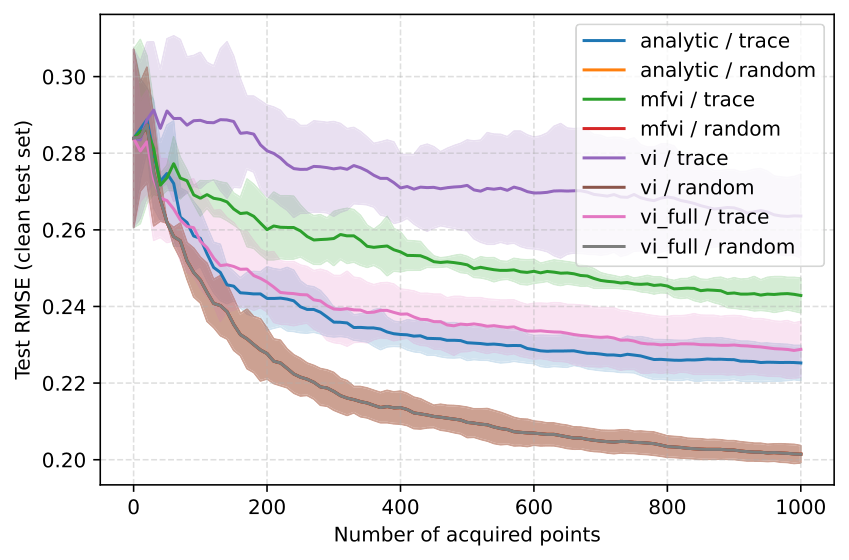

Classification:

When we add label noise (η = 0.15), all methods become less stable and the final accuracy is lower than with clean labels (η = 0.0). Even with noise, BALD and Entropy are usually better than Random, especially after the first ~100–300 acquired points, although there can be small drops after retraining.

Regression: in both settings (η = 0.0 and η = 0.15), Random acquisition consistently gives lower RMSE than trace for all inference methods (analytic / MFVI / VI / full VI). With noisy labels, this difference becomes even clearer: the trace rule focuses on the most uncertain points, and if some of those labels are wrong, training can be harmed more. Random sampling spreads the risk more evenly and works more reliably in our setup.

